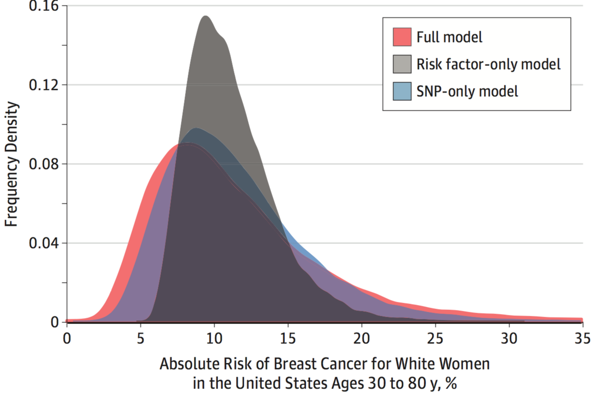

---
title: Lethal Cancer Risk Factors in NHANES
subtitle: Multidimensional Analysis of Potential Cancer Mortality Risk Factors in the National Health and Nutrition Examination Survey
author:
- Martin Skarzynski
- Prof. Elizabeth Platz
institute: Johns Hopkins School of Public Health
date: "2018-03-27"
output:
  word_document:
    reference_docx: style_nhanes.docx
bibliography: bibliography_nhanes.bib
csl: biomed-central.csl
---

This is a test.
IF it works x should be equal to 5 below.
x=5

This is a table:


|                  |  mpg| cyl| disp|  hp| drat|
|:-----------------|----:|---:|----:|---:|----:|
|Mazda RX4         | 21.0|   6|  160| 110| 3.90|
|Mazda RX4 Wag     | 21.0|   6|  160| 110| 3.90|
|Datsun 710        | 22.8|   4|  108|  93| 3.85|
|Hornet 4 Drive    | 21.4|   6|  258| 110| 3.08|
|Hornet Sportabout | 18.7|   8|  360| 175| 3.15|
|Valiant           | 18.1|   6|  225| 105| 2.76|


This is a chunk (not included).


This is another chunk (included).

```r
x=5
x
```

```
## [1] 5
```

This is a list
- item1
- item2
- item3

This is an image

