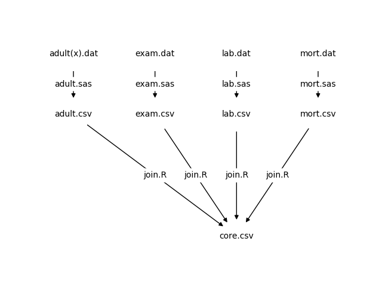

# Context

Large epidemiologic studies,

- such as the National Health and Nutrition Examination Survey (NHANES),
- collect copious high-dimensional data and
- allow for examination of multiple exposures in relation to a given outcome.

# Goals
1. Explore the exposures measured in the Third NHANES (NHANES III) dataset
2. Search for factors associated with cancer mortality
3. Assess a variable selection method for cancer risk prediction models

# Participants

NHANES III collected data on 33,994 participants aged 2 months and older from 1988 to 1994 in the United States, including [Interview, Medical Examination, and Laboratory components](https://wwwn.cdc.gov/nchs/nhanes/nhanes3/DataFiles.aspx).

The National Center for Health Statistics (NCHS) linked NHANES III data with mortality data from the [National Death Index (NDI)](https://www.cdc.gov/nchs/data-linkage/mortality-public.htm).

From the initial pool of participants, we selected 16,404 adult ($age \geq 18$) participants who

- were cancer-free at baseline and
- had no missing values for
  - follow-up time since interview,
  - NDI mortality,
  - primary sampling units (PSU),
  - stratification, and
  - sampling weight variables.

Among the 16,404 participants, there were 964 cancer deaths and 280,891 total years of follow-up.

# Exposures

The initial publicly available dataset contained 3,544 exposures from the Interview, Medical Examination, Laboratory, and Mortality components.

We obtained the final set of 243 exposures, after removing variables that were

- non-numeric,
- missing any values,
- correlated to another variable greater than 0.9, or
- only had one unique value.

# Data Processing

We modified the [SAS code provided by NCHS](https://wwwn.cdc.gov/nchs/nhanes/nhanes3/DataFiles.aspx) to save the data as comma-separated-value (`.csv`) files, which are available on [FigShare](https://figshare.com/articles/adult_csv/6210263). The SAS code files (`.sas`) and analogous Jupyter Notebook files (`.ipynb`) are available on [GitHub](https://github.com/marskar/nhanes).
{width=65%}

# Methods
1. We fit thousands of Cox proportional hazards models with and without ridge penalties to randomly selected subsets of up to 50 variables.
2. We analyzed the descriptions of NHANES III variables provided by the National Center for Health Statistics (NCHS) and selected 3 variables known to be related to cancer risk (age, sex and race/ethnicity) to include in all future models.
3. We then compared highly significant variables (p < 10^-10^) that appeared most frequently in the Cox models and selected 5 high-frequency highly significant variables that we used to train a new group of models with fewer randomized variables.

# Modeling

![Cancer Mortality Risk Prediction Models. \break Each point in the scatter plot represents a Cox proportional hazards model (n = 3789). The sizes of the points are relative to the number of variables (maximum = 50) in each the model, while the shapes correspond to whether ridge penalties were applied (triangle) or not (circle). The colors of points distinguish between models that had 0 (Groups 1A-D; green, cyan, blue, purple), 3 (Group 2; orange) or 8 (Group 3; red) non-randomized predictor variables. Additionally, Group 1 models are further color coded by quadrants based on concordance and Akaike Information Criterion (AIC) values as follows: high-concordance and low-AIC (Group 1A; green), high-concordance and high-AIC (Group 1B; cyan), low-concordance and low-AIC (Group 1C; blue), low-concordance and high-AIC (Group 1D; purple). All Group 3 models have concordance values of 84 or higher (black horizontal line).](index/figure/1-quad-final.pdf){height=60%}

# Analysis of variables

![Lethal Cancer Risk Predictor Variables. \break Each point in the volcano plot represents a predictor variable (n = 98787) from a Cox proportional hazards model (n = 3789) trained on NHANES III data. Variables are considered to be highly significant when their negative log10 p-values (y-axis) are above 10 (black horizontal line), regardless of their log2 hazard ratios (x-axis). The shapes of points correspond to whether ridge penalties were applied (triangle) or not (circle). The colors of points describe the model each variable come from as in Figure 1.](index/figure/2-volcano-final.pdf){height=60%}

# The most frequent highly significant variables

{height=60%}

# Apply domain knowledge to the top variables

|Name     | Median HR|    n|  Description |
|:--------|:---------|:----|:-------------|
|HSAGEIR  |      1.04| 2016| Age in Years |
|HAQ1     |      1.07| 1415| How would you describe the condition of your natural teeth (excellent, very good, good, fair or poor)? |
|HAT2     |      1.50|  384| In the past month, did you jog or run? |
|HAT16    |      1.67|  256| In the past month, did you lift weights? |
|HAB7     |      0.99|  228| In the past 12 months, how many times were you in a nursing home? |
|DMAETHNR |      1.14|  224| Race/Ethnicity |
|HAK9     |      1.23|  216| How many times per night do you usually get up to urinate? |
|HAP2     |      0.81|  179| Do you use glasses, contacts, or both? |
|HAT10    |      1.43|  119| In the past month, did you do other dancing? |
|HAR1     |      0.63|   96| Have you smoked at least 100 cigarettes during your entire life? |

# Results Summary
1. The models with fewer randomized variables outperformed the fully randomized models in terms of concordance.
2. Across all of the models, the ten variables that most frequently surpassed the p-value threshold were
   - age,
   - race/ethnicity,
   - lifetime consumption of more than 100 cigarettes,
   - 3 variables that pertain to physical activity, and
   - 3 variables that may be related to aging.

# Conclusions
1. The work described here constitutes an exploratory analysis of the NHANES III dataset that employs an iterative strategy for the generation of cancer risk prediction models.
2. Looking beyond this demonstration of a variable selection method, our ultimate goal is to build upon previously-described cancer risk factors towards
   - the discovery of novel contributors to cancer risk,
   - a deeper understanding of cancer etiology, and
   - an improved ability to predict cancer incidence and mortality.
